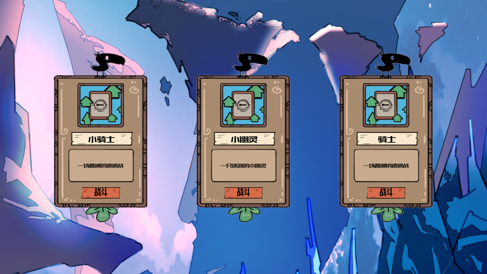
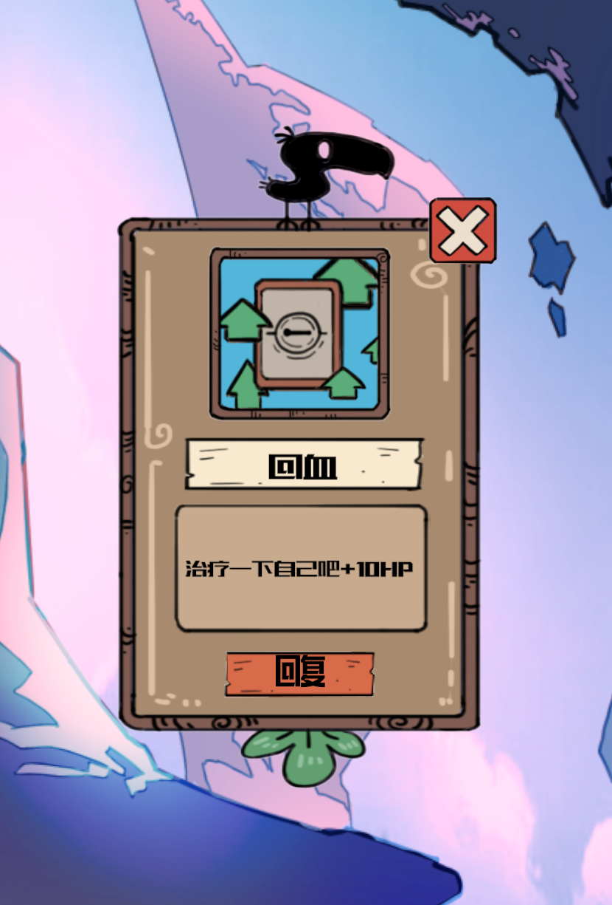
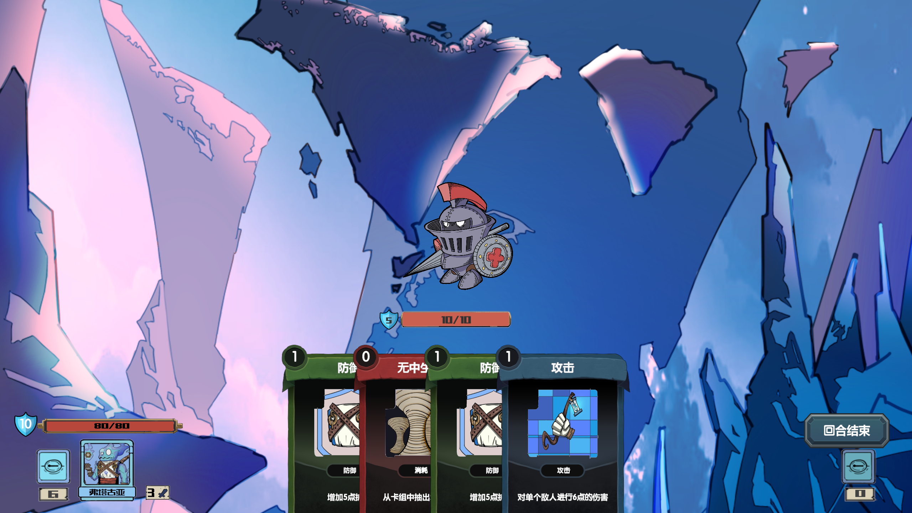
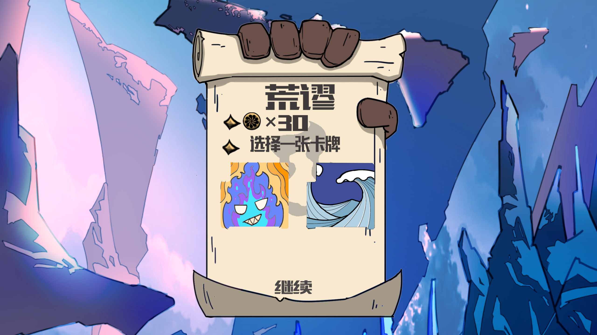

# ccgdemo

### 类杀戮尖塔的 CCG 卡牌游戏
类杀戮尖塔的对战形式 + 类月圆之夜的关卡选择
实现了一套简易的UI框架，根据MVC模式，所有面板由UIManager管理显示、隐藏、获取、添加自定义事件等，所有面板类拥有共同的UIBase基类，定义面板公有功能，获取所有UI控件并注册UI事件，方便子类使用
通过Excel表格导入卡牌、怪物和关卡信息，自动生成对于的游戏对象

### 关卡选择

### 战斗界面

